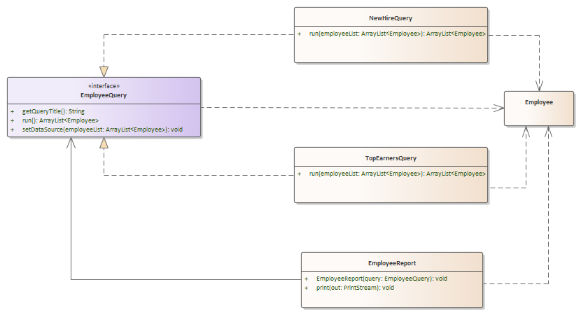

## ICE-11: Interfaces

## ICE 11-1 – Basic Interfaces (25 minutes)



All of the classes and interfaces have been created, but you will have to finish implementation

- EmployeeQuery - Nothing to do

- Employee - Nothing to do

- EmployeeReport - Nothing to do

- NewHireQuery

  - Implement the EmployeeQuery interface

  - **run** method - return the list of employees who have been hired in the last 30 days

    Paste the following code into the run method:

    ```Java
    ArrayList<Employee> result = new ArrayList<>();
    
    LocalDate thirtyDaysAgo = LocalDate.now().minusDays(30);
    for (Employee employee : employeeList) {
        if (employee.getHireDate().compareTo(thirtyDaysAgo) >= 0){
        	result.add(employee);
        }
    }
    
    return result;
    ```

    

  - getQueryTitle - Return "New Hires in Last 30 Days"

- TopEarnersQuery

  - Implement the EmployeeQuery interface
  - Return the list of employees who make more than $100,000
  - getQueryTitle - Return "Top Earners"

- Program

  - In the main method, paste the following code to create an employee population 

    ```Java
  ArrayList<Employee> emps = new ArrayList<>();
    Employee emp;
  emp = new Employee("12345", "Joe", LocalDate.now().minusYears(1), 57000);
    emps.add(emp);
    emp = new Employee("12346", "Julia", LocalDate.now().minusYears(10), 120000);
    emps.add(emp);
    emp = new Employee("12347", "Jasmin", LocalDate.now().minusDays(30), 62500);
    emps.add(emp);
    emp = new Employee("12348", "Jose", LocalDate.now().minusDays(29), 110000);
    emps.add(emp);
    emp = new Employee("12349", "Jontil", LocalDate.now().minusDays(31), 102000);
    emps.add(emp);
    emp = new Employee("12340", "Jack", LocalDate.now().minusDays(0), 99999);
    emps.add(emp);
    emp = new Employee("12345", "Jarrod", LocalDate.now().minusYears(6), 89000);
    emps.add(emp);
    ```
  
    
  
  - Write a snippet of code after the employee population creation that:
  
    - Creates instances of NewHireQuery and TopEarnersQuery (but declare them as type EmployeeQuery)
    - Call setDataSource for each query and pass your emps reference from above
    - Create an employee report for each and calls print passing in the System.out as the PrintStream object


